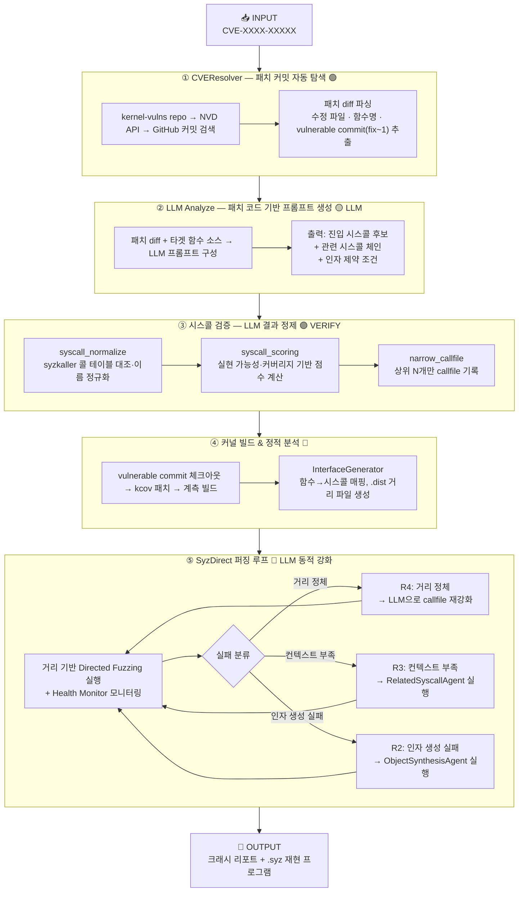

# CVE 기반 자동 타겟 퍼징 파이프라인

> SyzDirect + LLM을 결합한 취약점 자동 재현 시스템 흐름도

---

## 전체 흐름 (Mermaid)



---

## 단계별 설명

| 단계 | 이름 | 핵심 동작 | 주요 모듈 |
|------|------|-----------|-----------|
| ① | **CVEResolver** | CVE ID → 패치 커밋 해시 자동 탐색 (3개 소스 순차 시도) | `cve_resolver.py` |
| ② | **LLM Analyze** | 패치 diff + 타겟 소스 기반 LLM 프롬프트 생성 및 호출 | `llm_enhance.py` |
| ③ | **시스콜 검증** | LLM 제안 시스콜의 유효성 검증 및 점수 기반 정제 | `syscall_normalize.py`, `syscall_scoring.py` |
| ④ | **커널 빌드** | kcov 계측 커널 빌드 + 함수→거리 정적 분석 | `kernel_build.py`, `InterfaceGenerate.py` |
| ⑤ | **퍼징 루프** | 거리 기반 퍼징 + 실패 분류 → 에이전트 피드백 강화 | `agent_loop.py`, `failure_triage.py` |

---

## LLM 활용 포인트

```
CVE 입력
   │
   ├─ [LLM #1] 패치 diff 분석
   │           패치로 수정된 코드를 읽고
   │           어떤 시스콜 체인이 취약 경로에 도달할 수 있는지 제안
   │
   └─ [LLM #2] 퍼징 중 동적 강화
               거리가 정체될 때 현재 callfile을 LLM에 재분석 요청
               → 새로운 시스콜 변형 / 인자 조합 추가
```

---

## 핵심 특징 요약

- **완전 자동화**: CVE 번호 하나로 패치 커밋 탐색 → 커널 빌드 → 퍼징까지 전 과정 자동 실행
- **LLM 이중 활용**: 초기 시스콜 체인 생성 + 퍼징 중 동적 재강화 두 단계에서 LLM 사용
- **검증 루프**: LLM 출력은 항상 syzkaller 콜 테이블·점수 계산을 거쳐 유효성 검증 후 사용
- **에이전트 피드백**: 실패 원인(R2/R3/R4)을 자동 분류해 전용 에이전트로 템플릿 강화
